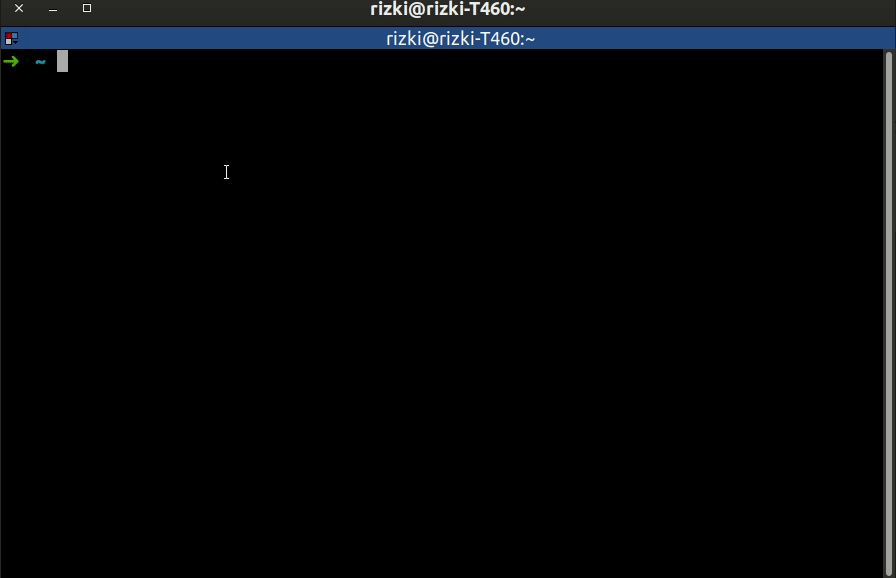

# Hermes

Save and sync your ssh config in private repository



*Disclaimer*
```
- Use with your own risk
- Never use public repository to save your config
```

## Prerequisite

```
- install sshpass - https://linux.die.net/man/1/sshpass
```

## Installation

```
curl -L https://github.com/rzkmak/hermes/releases/download/0.0.2/hermes -o hermes -H 'Accept: application/octet-stream' && sudo chmod +x hermes && sudo mv hermes /usr/local/bin
```

## How to Use

- Create your private repository to save the config, add config there with format example in `example/config.yaml`
- Run `hermes init ${your_private_url_repository}`
- Run `hermes connect ${hostname}` to connect specific hostname, require default user per hostname (see example)
- Run `hermes connect user@hostname` to connect specific hostname with specific user
- Run `hermes connect ${alias}` to connect with alias (see example)
- Run `hermes list` to view all available config

## How to Update Local Config

- Run `hermes update`


## How to Remove Local Config

- Run `hermes destroy`
